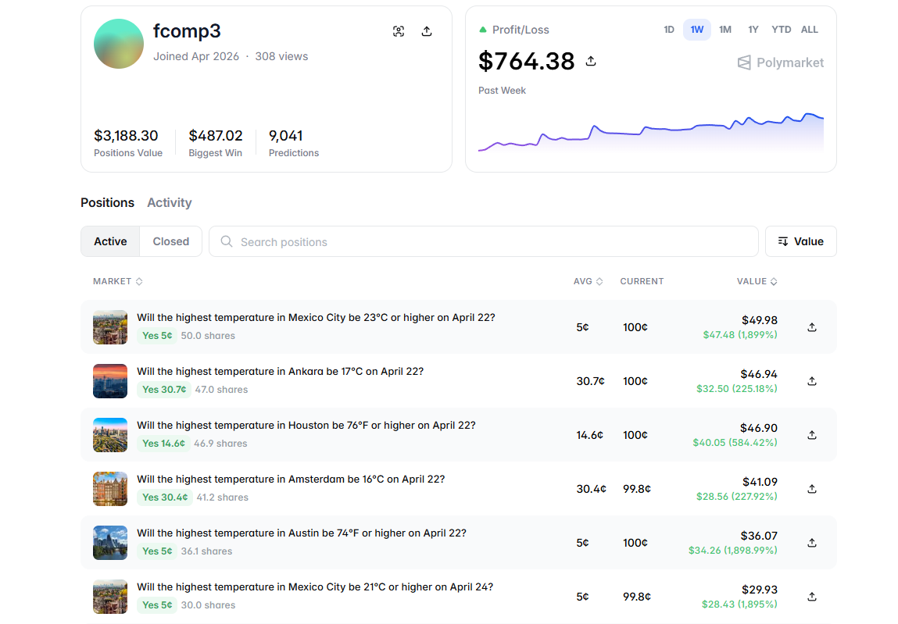

# Polymarket Weather Trading Bot

Node.js / TypeScript trading automation for Polymarket daily temperature markets. The bot combines National Weather Service (NWS) forecast data with Polymarket CLOB pricing: it maps a city’s forecast max temperature to a market bucket, then supports read-only signals, paper trading in a local JSON ledger, or live orders.

## Overview

The bot scans configured cities, finds the matching temperature range for the forecast, compares the YES price to entry and exit thresholds, and either prints signals, updates `simulation.json`, or posts real CLOB orders depending on the selected npm script. Runtime configuration is driven by `.env` (not `config.json` at execution time for the main flows described here).

---



---

https://github.com/user-attachments/assets/a4940d4d-be6e-478b-b2ba-1c84ecaa5c74

---

https://github.com/user-attachments/assets/70ef0168-1671-4057-bb4b-c3435016732b

---

### Key features

- **NWS-driven**: Uses NWS observations and forecast data to estimate daily max temperature.
- **Bucket matching**: Picks the Polymarket outcome range that contains the forecast temperature.
- **Three execution modes**: Signal-only, paper (simulated PnL in `simulation.json`), and live CLOB trading.
- **Proxy wallet support**: MetaMask signer with Polymarket proxy funder when `USE_PROXY_WALLET` and `SIGNATURE_TYPE=2` are set.
- **Recurring runs**: Optional `--interval` for scheduled live execution (see `npm run trade`).

## Architecture

### Technology stack

- **Runtime**: Node.js, TypeScript
- **Chain**: Polygon
- **Execution**: Polymarket CLOB via `@polymarket/clob-client`
- **Data**: NWS APIs for location-specific weather (see `src/nws.ts` and related modules)
- **Config**: `.env` for secrets and strategy parameters; `config.json` is not used for runtime config in the primary flows documented below

### System flow

```
NWS forecast + city list → Polymarket event for date
→ Map temp to bucket → Compare YES to ENTRY_THRESHOLD / EXIT_THRESHOLD
→ Signal | Update simulation | Place order
```

## Installation

### Prerequisites

- Node.js 18+ and npm
- A wallet with USDC on Polymarket for live mode, with keys from environment only
- NWS and Polymarket API reachability

### Setup

1. **Clone the repository and enter the directory**

   ```bash
   git clone <repository-url>
   cd Polymarket-Weather-Bot
   ```

2. **Install dependencies**

   ```bash
   npm install
   ```

3. **Configure environment**

   ```bash
   cp .env.sample .env
   ```

   Edit `.env`. Example:

   ```env
   POLYMARKET_PRIVATE_KEY=0xYOUR_METAMASK_PRIVATE_KEY
   POLYMARKET_PROXY_WALLET_ADDRESS=0xYOUR_POLYMARKET_PROXY_WALLET
   USE_PROXY_WALLET=true
   SIGNATURE_TYPE=2
   ENTRY_THRESHOLD=0.15
   EXIT_THRESHOLD=0.45
   MAX_TRADES_PER_RUN=5
   MIN_HOURS_TO_RESOLUTION=2
   LOCATIONS="nyc,chicago,miami,dallas,seattle,atlanta"
   ```

4. **Credentials**

   For live trading, confirm the private key, proxy address, USDC balance, and Polymarket trading allowance. Test with `signal` and `paper` before `execute` / `trade`.

## Configuration

### Environment variables

| Variable | Type | Default | Description |
|----------|------|---------|-------------|
| `POLYMARKET_PRIVATE_KEY` | string | **required** for live | MetaMask (or EOA) private key |
| `POLYMARKET_PROXY_WALLET_ADDRESS` | string | **required** for live with proxy | Polymarket proxy funder from account settings |
| `USE_PROXY_WALLET` | boolean | `false` (see code) | When `true`, use proxy; typically pair with `SIGNATURE_TYPE=2` |
| `SIGNATURE_TYPE` | `0` \| `1` \| `2` | derived | `0` EOA, `1` Polymarket proxy, `2` Gnosis Safe / browser flow |
| `ENTRY_THRESHOLD` | number | `0.15` | Buy when matching bucket YES is below this |
| `EXIT_THRESHOLD` | number | `0.45` | Exit when held YES is above this |
| `MAX_TRADES_PER_RUN` | number | `5` | Cap entries per run |
| `MIN_HOURS_TO_RESOLUTION` | number | `2` | Skip markets resolving sooner than this |
| `LOCATIONS` | string | multi-city | Comma-separated city keys to scan |

### Supported cities (typical)

`nyc`, `chicago`, `miami`, `dallas`, `seattle`, `atlanta` (see `LOCATIONS` and source for the authoritative list).

## Usage

### Build and run modes

| Mode | Command | Real orders? |
|------|---------|--------------|
| Signal | `npm run signal` | No |
| Paper | `npm run paper` | No (writes `simulation.json`) |
| One-shot live | `npm run execute` | Yes |
| Live on interval | `npm run trade` | Yes (30-minute interval) |

```bash
npm run signal
npm run paper
npm run execute
npm run trade
```

### Other scripts

```bash
npm run positions   # list open (paper) positions
npm run reset       # reset simulation state
```

## Technical details

### Entry logic (high level)

1. Load forecast max temperature for each configured city and resolution window.
2. Find the Polymarket market whose temperature bucket contains that value.
3. If YES is below `ENTRY_THRESHOLD` and other guards pass (horizon, max trades, existing position), open.
4. If already holding, exit when YES reaches `EXIT_THRESHOLD` (or per implementation in `src/strategy.ts`).

### State

- **Paper / simulation**: `simulation.json` tracks virtual balance and open legs (file is gitignored).

## Project structure

```
Polymarket-Weather-Bot/
├── public/
│   ├── weather.png            # README / demo still (add asset)
│   └── weather.mp4          # optional local demo
├── src/
│   ├── index.ts
│   ├── config.ts
│   ├── nws.ts
│   ├── polymarket.ts
│   ├── clob.ts
│   ├── strategy.ts
│   ├── simState.ts
│   ├── walletBalance.ts
│   ├── parsing.ts
│   ├── time.ts
│   └── colors.ts
├── dist/                      # tsc output
├── simulation.json            # local paper state (gitignored)
├── package.json
├── tsconfig.json
├── .env.sample
└── README.md
```

## API integration

### CLOB

Orders use `@polymarket/clob-client` with the configured signer and, when used, the Polymarket proxy as funder.

### NWS

Forecast and related endpoints are accessed from `src/nws.ts` and supporting modules; respect NWS terms of use and rate limits.

## Monitoring and logging

- Console output with chalk styling for readability.
- Paper mode: inspect `simulation.json` and `npm run positions`.

## Change history

Worth tracking for this project:

1. **Mode gating**: Always validate `signal` → `paper` → `execute` before scaling size.
2. **simulation state**: Regenerated locally; not suitable for commit.

## Risk considerations

1. **Forecast error**: NWS data can disagree with the resolution source Polymarket uses.
2. **Liquidity and slippage**: YES/NO books may be thin.
3. **Time to resolution**: Short horizons increase sensitivity to price moves.
4. **Live credentials**: A mistake in `POLYMARKET_*` or allowance can still move real funds.

**Operational suggestions**: Run `signal` and `paper` first, use small size in `execute`, and monitor until you trust the end-to-end path.

## Development

```bash
npm run build
npm run signal
```

## Support

Use repository issues for bugs and feature requests. For CLOB and proxy wallet behavior, refer to Polymarket’s official documentation.

---

**Disclaimer**: This software is provided as-is, without warranty. Prediction markets and digital assets involve substantial risk of loss. Use only capital you can afford to lose and comply with applicable laws in your jurisdiction.

**Version**: 1.0.0  
**Last updated**: April 2026
